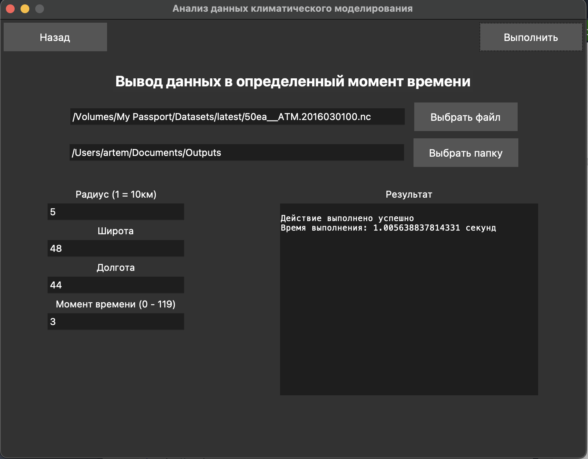
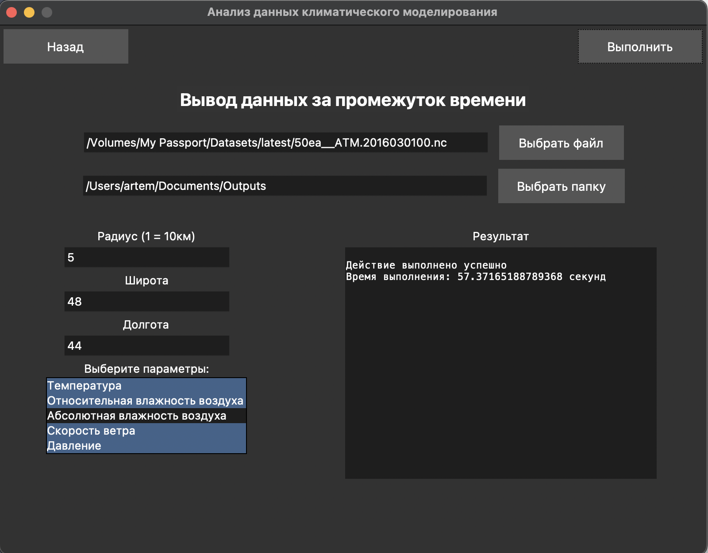
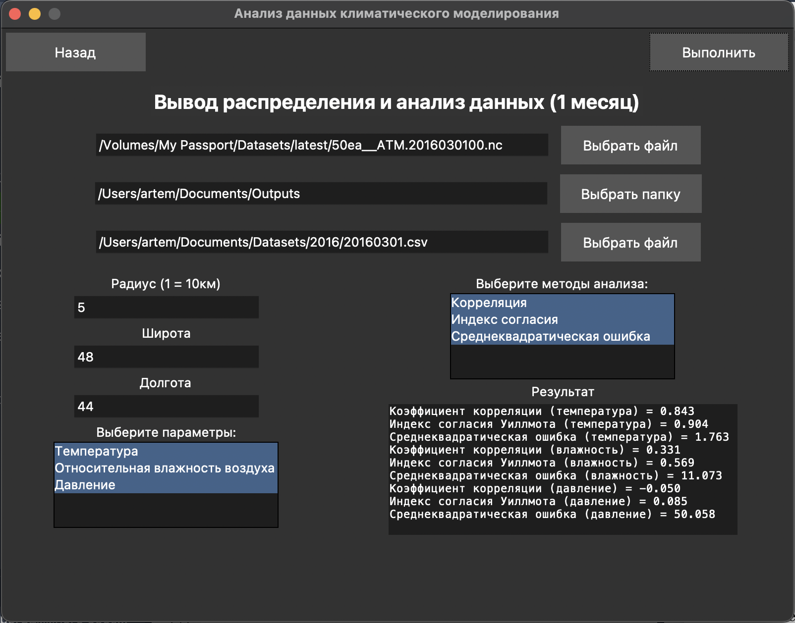
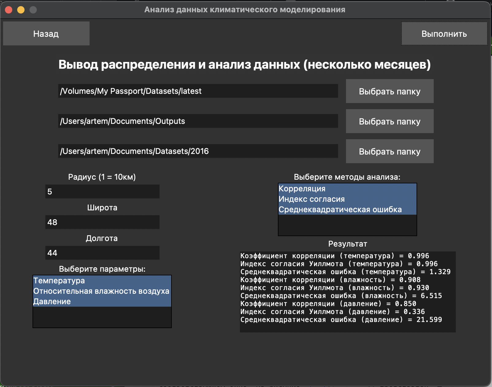

# Анализ данных климатического моделирования

Программное обеспечение, разработанное для анализа и визуализации климатических данных, предоставляющее возможность оценки и прогнозирования климатических изменений на основе региональной климатической модели RegCM 4.9.

## Использование

### Главное меню: Выбор сценария обработки климатических данных
- **Описание**: Меню для выбора сценария работы с данными.
- **Как использовать**: Запустите main.py.

### Сценарий 1: Вывод данных в определенный момент времени
- **Описание**: Вывод данных в заданный момент времени для выбранной географической точки (широта и долгота в системе WGS84) и радиуса.
- **Данные для вывода**: Температура, относительная и абсолютная влажность воздуха, давление, скорость ветра.
- **Как использовать**: Запустите скрипт с параметрами широты, долготы, радиуса и временной метки (индекс времени из `dataset.variables['time']`).
- **Результат работы программы**: 

### Сценарий 2: Вывод данных за промежуток времени
- **Описание**: Вывод определенных данных за весь временной диапазон датасета.
- **Данные для вывода**: Температура, относительная и абсолютная влажность воздуха, давление, скорость ветра.
- **Как использовать**: Запустите скрипт с параметрами широты, долготы, радиуса и укажите переменные для вывода.
- **Результат работы программы**: 

### Сценарий 3: Обработка и анализ данных (1 датасет)
- **Описание**: Выводит усредненные по дням данные и проводит статистический анализ, включая расчет коэффициентов корреляции, индекс согласия Уилмотта и среднеквадратическую ошибку.
- **Данные для вывода**: Температура, относительная влажность воздуха, давление.
- **Как использовать**: Запустите скрипт с параметрами широты, долготы, радиуса и укажите переменные для вывода. Укажите данные для сравнения (расчитывается использование данных с сайта: [погодаиклимат](http://www.pogodaiklimat.ru/weather.php?id=34560&bday=1&fday=31&amonth=1&ayear=2016&bot=2)).
- **Результат работы программы**: 

### Сценарий 4: Обработка и анализ данных (несколько датасетов)
- **Описание**: Аналогично Сценарию 3, но для нескольких месяцев.
- **Результат работы программы**: 

### Сценарий 5: Обработка и анализ данных температуры (для данных 20 века)
- **Описание**: Выводит и анализирует исторические данные температуры.
- **Данные для вывода**: Температура.
- **Как использовать**: Запустите скрипт с параметрами широты, долготы, радиуса и укажите переменные для вывода. Укажите данные для сравнения (расчитывается использование данных с сайта: [погодаиклимат](http://www.pogodaiklimat.ru/history/34560.htm)).

